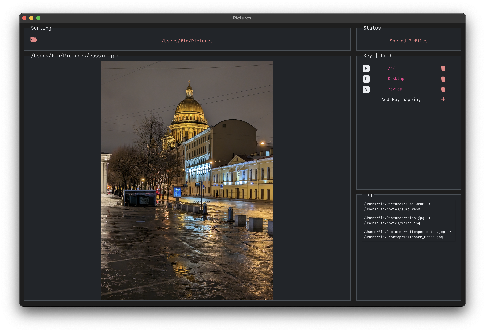

# LeafSort



A minimalist media sorter based on [Leafview](https://github.com/sprout2000/leafview) and [Electron](https://www.electronjs.org/).

## Development

Install dependencies:

```sh
npm i
```

Start server:

```sh
npm run dev
```

### Release

Find the latest release [here](https://github.com/aijc/leafsort/releases).

## Usage

Once installed, select a folder from the header or gallery panel, and add some key binds from the Key Map panel.

Expand the Log panel to view sorting history, and to undo operations.